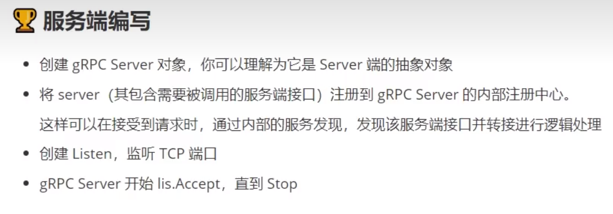

# gRPC 的学习

1. 需要下载protobuf的编译器，在官网下载好之后，需要将 bin 目录配置到 path 环境变量中，命令行中输入命令 `protoc --version` 出现版本号即表示安装成功。

2. gRPC需要使用 `go get google.golang.org/grpc` 命令来下载 gRPC 的核心库。

3. 还需要下载代码生成工具，使用
   - `go install google.golang.org/protobuf/cmd/protoc-gen-go@latest`
   - ` go install google.golang.org/grpc/cmd/protoc-gen-go-grpc@latest`

4. 上面两个 go install 命令会安装两个 exe 文件到 ￥GOPATH/bin 目录下。

## proto 文件的编写

proto文件，是分别写在每一个需要连接的程序里面，类似于结构文档，是一种约束，表示所有的程序都需要依据这个文件进行通信。

例如在 hello-server 端有一个 proto 文件，在 hello-client 端也有一个 proto 文件，并且要求两个文件得内容是一样的，也就是一样的标准，这样才能进行通信。

```go
//这是在说明我们使用的是proto3语法。
syntax = "proto3";

// 这部分的内容是关于最后生成的go文件是处在哪个目录哪个包中，.代表在当前目录生成，service代表了生成的go文件的包名是service。
option go_package =".;service";

//然后我们需要定义一个服务，在这个服务中需要有一个方法，这个方法可以接受客户端的参数，再返回服务端的响应。
// 其实很容易可以看出，我们定义了一个service，称为SayHeLLo，这个服务中有一个rpc方法，名为SayHeLLo。
// 这个方法会发送一个HeLLoRequest，然后返回一个HeLLoResponse。
service SayHello {
  rpc SayHello(HelloRequest) returns (HelloResponse) {}
}

//message关键字，其实你可以理解为GoLang中的结构体。
// 这里比较特别的是变量后面的"赋值"。注意，这里并不是赋值，而是在定义这个变量在这个message中的位置。
message HelloRequest {
  string requestName = 1;
  // int64 age = 2;
}

message HelloResponse{
  string responseMsg = 1;
}
```

之后进入 `proto` 文件的目录下，使用命令生成 go 语言代码和 proto 相应文件：
  - `protoc --go_out=. hello.proto`
  - `protoc --go-grpc_out=. hrllo.proto`




